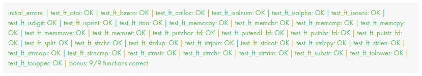

# libft
42Cursus-libft/42Lisboa

> [subject](subject.pdf)
# Contents
1. [Intro](https://github.com/mlanca-c/libft/blob/main/README.md#intro)
	* [Keywords](https://github.com/mlanca-c/libft/blob/main/README.md#Keywords)
2. [Mandatory]()
3. [Bonus]()
	* [Singly linked List]()
9. [Results](https://github.com/mlanca-c/libft/blob/main/README.md#Results)

# Intro
 This is th
 The aim of this project is to code a C library regrouping usual functions that you’ll be allowed to use in all your other projects.
 This project 
## Keywords

# Results

